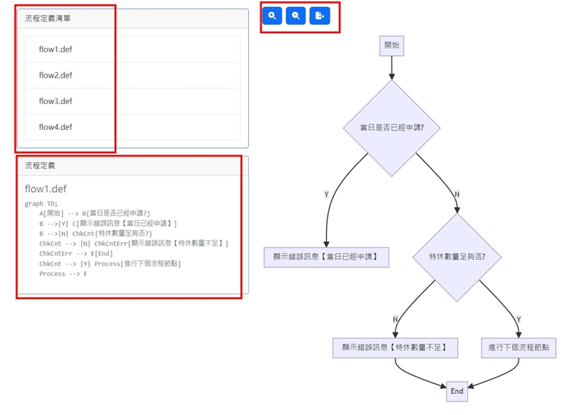

# Project Name
一個使用 React 開發的動態 Mermaid 圖表檢視應用程式。

## Description
A React application for dynamically rendering Mermaid charts. This project allows users to easily view and interact with various flowcharts and diagrams using the Mermaid library. Features include zooming in/out, exporting diagrams, and switching between different chart definitions.

一個使用 React 開發的動態 Mermaid 圖表渲染應用程式。此專案讓使用者能夠輕鬆創建、查看及與各種流程圖和圖表進行互動，通過 Mermaid 圖表庫實現。

## Features
- Zoom in/out (放大/縮小)
- Export diagrams (導出圖表)
- Switch between different chart definitions (在不同圖表定義間切換)

## Installation
```bash
git clone https://github.com/hahalin/MermaidViewer.git
cd MermaidViewer
npm install
npm start
```



